# Entity-Relationship Diagram — Ice Truck Tracking Platform

## ER Diagram (Mermaid)

```mermaid
erDiagram
    USERS ||--o{ REFRESH_TOKENS : "has"
    USERS ||--o{ AUDIT_LOG : "performs"
    USERS ||--o{ DRIVERS : "is"
    TRUCKS ||--o{ TELEMETRY : "generates"
    TRUCKS ||--o{ ALERTS : "triggers"
    TRUCKS ||--o{ DRIVERS : "assigned to"
    ROUTES ||--o{ ROUTE_STOPS : "contains"
    SHOPS ||--o{ ROUTE_STOPS : "visited in"
    TRUCKS ||--o{ ROUTES : "follows"

    USERS {
        uuid id PK
        varchar email UK "NOT NULL, UNIQUE"
        varchar password_hash "bcrypt cost 12"
        user_role role "admin|manager|dispatcher|driver|viewer"
        varchar full_name
        varchar phone
        boolean is_active "DEFAULT true"
        timestamptz created_at
        timestamptz updated_at
    }

    REFRESH_TOKENS {
        uuid id PK
        uuid user_id FK "→ users(id) CASCADE"
        varchar token_hash "SHA-256 hashed"
        uuid family "Token family for reuse detection"
        boolean revoked "DEFAULT false"
        timestamptz expires_at
        timestamptz created_at
    }

    TRUCKS {
        uuid id PK
        varchar plate_number UK "NOT NULL, UNIQUE"
        varchar model
        integer year
        numeric capacity_kg "CHECK > 0"
        truck_status status "active|maintenance|retired"
        jsonb metadata "Extensible fields"
        timestamptz created_at
        timestamptz updated_at
    }

    DRIVERS {
        uuid id PK
        uuid user_id FK "→ users(id)"
        uuid truck_id FK "→ trucks(id)"
        varchar license_number UK
        date license_expiry
        boolean is_active "DEFAULT true"
        timestamptz created_at
        timestamptz updated_at
    }

    SHOPS {
        uuid id PK
        varchar name "NOT NULL"
        varchar address
        numeric latitude
        numeric longitude
        varchar phone
        varchar contact_person
        boolean is_active "DEFAULT true"
        timestamptz created_at
        timestamptz updated_at
    }

    ROUTES {
        uuid id PK
        uuid truck_id FK "→ trucks(id)"
        varchar name "NOT NULL"
        date planned_date
        varchar status "planned|in_progress|completed|cancelled"
        timestamptz started_at
        timestamptz completed_at
        timestamptz created_at
    }

    ROUTE_STOPS {
        uuid id PK
        uuid route_id FK "→ routes(id) CASCADE"
        uuid shop_id FK "→ shops(id)"
        integer stop_order "Delivery sequence"
        numeric planned_quantity_kg
        numeric actual_quantity_kg
        timestamptz planned_arrival
        timestamptz actual_arrival
        varchar status "pending|arrived|delivered|skipped"
    }

    TELEMETRY {
        timestamptz time PK "Hypertable partition key"
        uuid truck_id FK "→ trucks(id)"
        numeric latitude "CHECK -90..90"
        numeric longitude "CHECK -180..180"
        numeric speed_kmh
        numeric temperature_c
        numeric fuel_level_pct
        numeric battery_voltage
        jsonb extra "Extensible sensor data"
    }

    ALERTS {
        timestamptz time PK "Hypertable partition key"
        uuid id UK "DEFAULT gen_random_uuid()"
        uuid truck_id FK "→ trucks(id)"
        alert_severity severity "info|warning|critical"
        alert_type type "temperature|speed|geofence|battery|maintenance"
        text message
        boolean acknowledged "DEFAULT false"
        uuid acknowledged_by FK "→ users(id)"
        timestamptz acknowledged_at
    }

    AUDIT_LOG {
        timestamptz time PK "Hypertable partition key"
        uuid id UK "DEFAULT gen_random_uuid()"
        uuid user_id FK "→ users(id)"
        varchar action "NOT NULL"
        varchar resource_type
        uuid resource_id
        jsonb old_value
        jsonb new_value
        inet ip_address
        varchar user_agent
    }
```

## TimescaleDB-Specific Features

### Hypertables

| Table     | Partition Column | Chunk Interval | Compression After | Retention |
| --------- | ---------------- | -------------- | ----------------- | --------- |
| telemetry | time             | 1 day          | 7 days            | 90 days   |
| alerts    | time             | 7 days         | 30 days           | 365 days  |
| audit_log | time             | 30 days        | 90 days           | 730 days  |

### Continuous Aggregates

| Aggregate        | Source    | Bucket | Refresh Policy       |
| ---------------- | --------- | ------ | -------------------- |
| telemetry_hourly | telemetry | 1 hour | Every 30 min, lag 2h |
| alerts_daily     | alerts    | 1 day  | Every 1 hour, lag 2h |

### Indexes

| Table     | Index                        | Type   | Purpose                        |
| --------- | ---------------------------- | ------ | ------------------------------ |
| telemetry | (truck_id, time DESC)        | B-tree | Fast per-truck time queries    |
| alerts    | (truck_id, time DESC)        | B-tree | Alert history by truck         |
| alerts    | (severity, acknowledged)     | B-tree | Unacknowledged critical alerts |
| audit_log | (user_id, time DESC)         | B-tree | User activity audit            |
| audit_log | (resource_type, resource_id) | B-tree | Resource change history        |
| trucks    | (metadata)                   | GIN    | JSONB field searches           |
| telemetry | (extra)                      | GIN    | Extensible sensor queries      |
